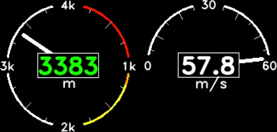

# Gauges
A tool to extract gpx data from a smartwatch and add it to your epic skydiving videos

 

Supports altitude, vertical speed, heart rate. Removes erroneous points, and generates a video.

[https://www.youtube.com/watch?v=1ht0PudSisM](https://youtu.be/1ht0PudSisM?si=DU1xQ7DKLemShtPh&t=49)

For the moment, only supports Garmin Instinct.

## TODO
- [ ] More watches
- [ ] Fully automatic gpx conversion
- [ ] Better faulty points elimination algorithm
- [ ] Jump and chute detection
- [ ] Glide ratio during free fall and landing
- [ ] Total glide distance
- [ ] 2D or 3D path
- [ ] Group jump stats, paths etc.
